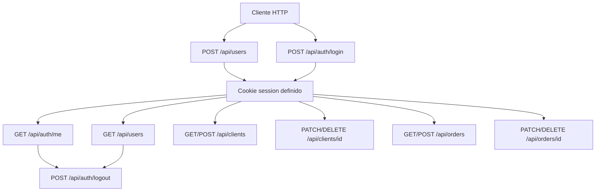
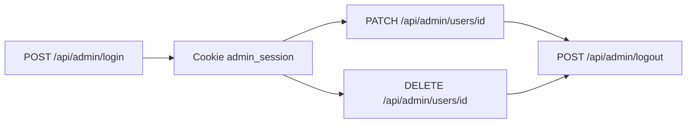
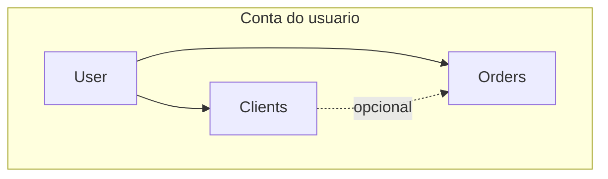

# Documentação das rotas da API

API implementada com [Route Handlers](https://nextjs.org/docs/app/building-your-application/routing/route-handlers) do Next.js em `src/app/api`. Todas as rotas usam o prefixo **`/api`**.

## Visão geral

- **Formato:** JSON (`Content-Type: application/json` nas requisições com corpo).
- **Cookies HTTP-only:**
  - **`session`:** JWT da sessão do usuário (HS256, expira em **7 dias**). Enviado automaticamente pelo navegador no mesmo site; em clientes HTTP use o header `Cookie` ou `credentials: "include"` no `fetch`.
  - **`admin_session`:** JWT do painel administrativo (expira em **8 horas**).
- **Segredo:** `AUTH_SECRET` (mínimo 16 caracteres) — usado para assinar os tokens.
- **Admin:** senha configurável por `ADMIN_PASSWORD` (padrão no código: `1234`); veja `src/lib/auth.ts`.
- **Validação:** campos validados com Zod; em falha de validação a resposta costuma ser **`400`** com `{ "error": "Validação falhou", "details": ... }`.

### Tabela de rotas

| Método | Caminho | Autenticação | Descrição resumida |
|--------|---------|--------------|-------------------|
| `POST` | `/api/auth/login` | Não (grava `session`) | Login com login e senha |
| `POST` | `/api/auth/logout` | Não (remove `session`) | Encerra sessão do usuário |
| `GET` | `/api/auth/me` | Opcional | Usuário atual ou `null` |
| `POST` | `/api/admin/login` | Não (grava `admin_session`) | Login admin com `senha` |
| `POST` | `/api/admin/logout` | Não (remove `admin_session`) | Encerra sessão admin |
| `PATCH` | `/api/admin/users/[id]` | Admin | Define nova senha do usuário |
| `DELETE` | `/api/admin/users/[id]` | Admin | Exclusão lógica do usuário |
| `POST` | `/api/users` | Não (grava `session`) | Registro de usuário |
| `GET` | `/api/users` | Usuário autenticado | Dados do próprio usuário (não excluído) |
| `PATCH` | `/api/users/[id]` | Próprio usuário | Atualiza login e/ou senha |
| `DELETE` | `/api/users/[id]` | Próprio usuário | Exclusão soft ou hard (`?mode=`) |
| `GET` | `/api/clients` | Usuário autenticado | Lista clientes da conta |
| `POST` | `/api/clients` | Usuário autenticado | Cria cliente |
| `PATCH` | `/api/clients/[id]` | Usuário autenticado | Atualiza cliente |
| `DELETE` | `/api/clients/[id]` | Usuário autenticado | Exclusão lógica do cliente |
| `GET` | `/api/orders` | Usuário autenticado | Lista pedidos (com nome do cliente) |
| `POST` | `/api/orders` | Usuário autenticado | Cria pedido |
| `PATCH` | `/api/orders/[id]` | Usuário autenticado | Atualiza pedido |
| `DELETE` | `/api/orders/[id]` | Usuário autenticado | Remove pedido (exclusão física) |

---

## Autenticação do usuário (`/api/auth`)

### `POST /api/auth/login`

Autentica e define o cookie `session`.

**Corpo (JSON):**

| Campo | Tipo | Obrigatório | Descrição |
|-------|------|-------------|-----------|
| `login` | string | Sim | Login do usuário |
| `senha` | string | Sim | Senha em texto plano |

**Respostas:**

| Status | Corpo / notas |
|--------|----------------|
| `200` | `{ "user": PublicUser }` |
| `400` | Validação Zod |
| `401` | `{ "error": "Login ou senha inválidos" }` |

`PublicUser`: `id`, `login`, `deletedAt`, `createdAt`, `updatedAt` (sem hash de senha).

### `POST /api/auth/logout`

Remove o cookie `session`. Não exige corpo.

**Respostas:** `200` — `{ "ok": true }`.

### `GET /api/auth/me`

**Respostas:**

| Status | Corpo |
|--------|--------|
| `200` | `{ "user": null }` se não houver sessão ou usuário não existir |
| `200` | `{ "user": PublicUser }` se autenticado |

---

## Painel administrativo (`/api/admin`)

Requer cookie `admin_session` (exceto login/logout).

### `POST /api/admin/login`

**Corpo:** `{ "senha": string }`.

**Respostas:**

| Status | Corpo |
|--------|--------|
| `200` | `{ "ok": true }` |
| `400` | `{ "error": "Corpo inválido" }` |
| `401` | `{ "error": "Senha incorreta" }` |

### `POST /api/admin/logout`

**Respostas:** `200` — `{ "ok": true }`.

### `PATCH /api/admin/users/[id]`

Redefine a senha de outro usuário (não precisa ser o próprio `id`).

**Corpo:**

| Campo | Tipo | Obrigatório |
|-------|------|-------------|
| `senha` | string | Sim (regras de senha forte, ver abaixo) |
| `senhaConfirmacao` | string | Sim (deve coincidir com `senha`) |

**Respostas:**

| Status | Corpo / notas |
|--------|----------------|
| `200` | `PublicUser` atualizado |
| `400` | Validação |
| `401` | `{ "error": "Não autorizado" }` |
| `404` | `{ "error": "Usuário não encontrado" }` |

### `DELETE /api/admin/users/[id]`

Exclusão **lógica** (`deletedAt`).

**Respostas:**

| Status | Corpo |
|--------|--------|
| `200` | `{ "ok": true, "mode": "soft" }` |
| `401` | Não autorizado |
| `404` | Usuário não encontrado |

---

## Usuários (`/api/users`)

### `POST /api/users`

Registro; após criar o usuário, define `session` automaticamente.

**Corpo:**

| Campo | Tipo | Obrigatório |
|-------|------|-------------|
| `login` | string | Sim (mínimo 2 caracteres) |
| `senha` | string | Sim (senha forte) |
| `senhaConfirmacao` | string | Sim (igual a `senha`) |

**Senha forte:** mínimo 8 caracteres; ao menos uma minúscula, uma maiúscula, um número e um caractere especial.

**Respostas:**

| Status | Corpo / notas |
|--------|----------------|
| `201` | `PublicUser` do usuário criado |
| `400` | Validação |
| `409` | `{ "error": "Este login já está em uso" }` |

### `GET /api/users`

Retorna o **próprio** usuário da sessão, se a conta estiver ativa (não soft-deleted).

**Respostas:**

| Status | Corpo |
|--------|--------|
| `200` | `PublicUser` |
| `401` | `{ "error": "Não autenticado" }` |
| `404` | `{ "error": "Usuário não encontrado" }` |

### `PATCH /api/users/[id]`

Só é permitido quando `[id]` é o **mesmo** que o usuário da sessão.

**Corpo:** pelo menos um campo.

| Campo | Tipo |
|-------|------|
| `login` | string (opcional, mínimo 2 caracteres) |
| `senha` | string (opcional, senha forte) |

**Respostas:** `200` — `PublicUser`; `400`, `401`, `403`, `404`, `409` (login duplicado) conforme o caso.

### `DELETE /api/users/[id]`

Só o próprio `[id]`.

**Query:** `mode` — `soft` (padrão) ou `hard`.

- **`soft`:** preenche `deletedAt`.
- **`hard`:** remove o registro do banco.

**Respostas:**

| Status | Corpo |
|--------|--------|
| `200` | `{ "ok": true, "mode": "soft" }` ou `{ "ok": true, "mode": "hard" }` |
| `400` | `mode` inválido |
| `401`, `403`, `404` | Conforme regras acima |

---

## Clientes (`/api/clients`)

Escopo: apenas clientes do `userId` da sessão. CPF é único **por conta** (entre registros ativos).

### `GET /api/clients`

**Respostas:** `200` — array de objetos públicos de cliente: `id`, `cpf`, `rg`, `nome`, `idade`, `email`, `createdAt`, `updatedAt`.  
`401` se não autenticado.

### `POST /api/clients`

**Corpo:**

| Campo | Tipo | Notas |
|-------|------|--------|
| `cpf` | string | 11 dígitos (não-dígitos são removidos na validação) |
| `rg` | string | Obrigatório |
| `nome` | string | Obrigatório |
| `idade` | number | Inteiro, 0–130 |
| `email` | string | E-mail válido |

**Respostas:** `201` — cliente criado; `400` validação; `401`; `409` CPF duplicado na conta.

### `PATCH /api/clients/[id]`

Mesmo formato de corpo que `POST` (schema `updateClientSchema` = `createClientSchema`).

**Respostas:** `200` — atualizado; `400`, `401`, `404`, `409`.

### `DELETE /api/clients/[id]`

Exclusão **lógica**.

**Respostas:** `200` — `{ "ok": true }`; `401`, `404`.

---

## Pedidos (`/api/orders`)

### `GET /api/orders`

Lista pedidos do usuário, ordenados do mais recente. Inclui join com cliente:

| Campo (exemplo) | Descrição |
|-----------------|-----------|
| `id`, `userId`, `clientId` | UUIDs; `clientId` pode ser `null` |
| `titulo`, `descricao`, `preco`, `quantidade` | Dados do pedido |
| `createdAt` | Data de criação |
| `clientNome` | Nome do cliente (ou `null` no left join) |

**Respostas:** `200` — array; `401`.

### `POST /api/orders`

**Corpo:**

| Campo | Tipo | Obrigatório |
|-------|------|-------------|
| `clientId` | string (UUID) | Não; omita ou vazio para pedido sem cliente vinculado |
| `titulo` | string | Sim, até 200 caracteres |
| `descricao` | string | Opcional, até 4000 caracteres |
| `preco` | number | ≥ 0 |
| `quantidade` | number inteiro | ≥ 1 |

Se `clientId` for informado, o cliente deve existir, não estar excluído e pertencer ao usuário da sessão.

**Respostas:** `201` — objeto do pedido criado; `400`, `401`, `404` (cliente inválido).

### `PATCH /api/orders/[id]`

Mesma forma de corpo que a criação. O pedido deve pertencer ao usuário.

**Respostas:** `200` — pedido atualizado; `400`, `401`, `404`.

### `DELETE /api/orders/[id]`

**Exclusão física** do registro.

**Respostas:** `200` — `{ "ok": true }`; `401`, `404`.

---

## Diagramas (Mermaid)

### Fluxo da sessão do usuário e recursos protegidos

### Fluxo administrativo

### Modelo lógico de dados (conta do usuário)

O vínculo `Orders` → `Clients` é opcional: `clientId` pode ser `null` no pedido.

---

## Manutenção

Sempre que novas rotas forem adicionadas em `src/app/api/**/route.ts`, atualize este arquivo para manter a tabela e as descrições alinhadas ao código.
